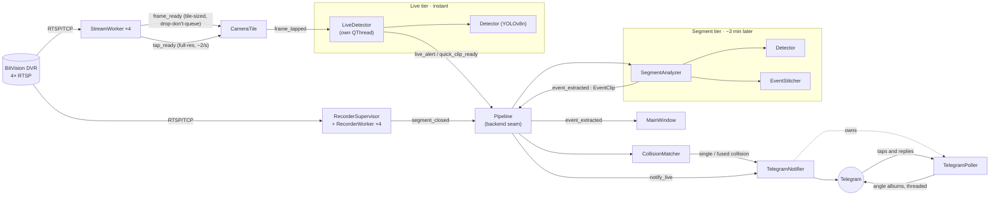
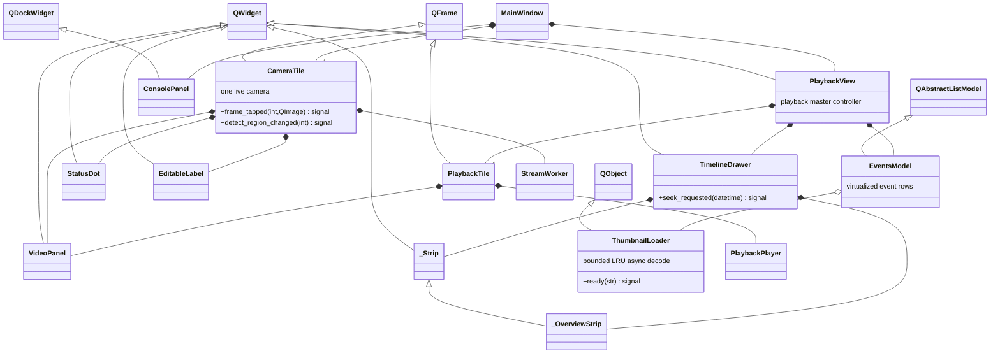
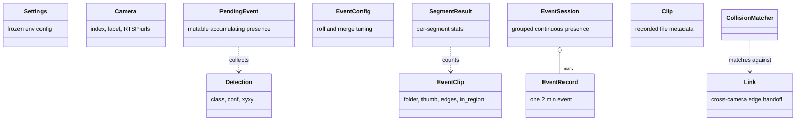

# Watchhouse

A local AI surveillance platform for legacy DVRs. Native Windows desktop app
that bridges 4 RTSP IP cameras hanging off a BitVision / Cantonk DVR and
turns them into a smart event log. No cloud, no installer, no telemetry.

Single self-contained `.exe`. Current release: **v0.4.76**.

## What's shipped

**Live & recording**
- 4-camera live grid (2x2) with per-tile sub / main stream toggle
- LAN auto-discovery of the DVR when its DHCP-assigned IP moves, with IP history cache
- Continuous per-camera recording (one supervised `ffmpeg` writer each), retention pruning
- DVR-side recorded playback: calendar, 2x2 tile grid, dual-strip timeline, pinned ranges
- Toggleable admin log console (Ctrl+L) with masked URLs and per-source filtering
- TCP-only RTSP with the ffplay tolerance flags, reconnect on stall with backoff

**AI detection (three tiers)**
- **Live tier** — YOLOv8n on live preview frames for instant alerts + quick pre-roll clips
- **Segment tier** — re-analyses finalised recordings, stitches continuous presence into
  events, extracts a thumbnail + per-camera clips per event
- Per-camera person-confidence floors (kills confident static false positives), detect
  regions that gate notifications, and a detection history log
- Cross-camera **movement matching**: named directional edge-handoff links fuse the same
  movement seen on two cameras into one event (not face/Re-ID — time + geometry + edge)

**Telegram**
- Push alerts (photo + caption) with inline buttons: 🎥 Capture / 🎬 All cameras
- Replies and button taps answered by a long-poll bot; angles delivered as one album,
  threaded onto the original alert, attributed to whoever asked
- Smart cross-tier dedupe so live + segment tiers never double-notify
- Family-friendly i18n (English / Arabic), DVR display-time offset on captions

## On the roadmap

- Polygon zones, zone-entry and loitering events
- Triggered face recognition + license-plate reading
- Watchdog / "analyzer idle" self-supervision
- Dashboard layer (review, filter, drill down)

## Architecture

Watchhouse is an object-oriented PySide6 (Qt6) app. Every long-running job is a
`QThread` or pooled `QRunnable`; the UI thread never blocks on I/O. `Pipeline`
is the backend composition root (recorder → analyzer → events → collision →
Telegram + the live alert tier), drivable headless; `MainWindow` is pure
presentation over its signals. Immutable `@dataclass` records (`Settings`,
`Camera`, `EventClip`, `Detection`, …) carry data between tiers. The diagrams
below are generated from the actual classes in `app/`.

### Runtime data flow

Capture splits into three tiers — a fast **live** path for instant alerts, a slower
**segment** path that produces durable events, and the **Telegram** I/O on top.



### Backend pipeline — class diagram

```mermaid
classDiagram
    class QMainWindow
    class QObject
    class QThread
    class QRunnable

    QMainWindow <|-- MainWindow
    QObject <|-- Pipeline
    QObject <|-- LiveDetector
    QObject <|-- RecorderSupervisor
    QObject <|-- TelegramNotifier
    QObject <|-- UiLoopProbe
    QThread <|-- StreamWorker
    QThread <|-- PlaybackPlayer
    QThread <|-- RecorderWorker
    QThread <|-- SegmentAnalyzer
    QThread <|-- TelegramPoller

    class MainWindow {
        pure presentation over Pipeline signals
    }
    class Pipeline {
        backend composition root, headless-drivable
        +recorder_stats(int,int,int) signal
        +ai_totals(int,int) signal
        +event_extracted(EventClip) signal
    }
    class StreamWorker {
        +frame_ready(QImage) signal tile-sized
        +tap_ready(QImage) signal full-res
        drop-dont-queue mailbox, scales on own thread
    }
    class PlaybackPlayer {
        +frame_ready(QImage) signal tile-sized
        deadline pacing, same mailbox
    }
    class RecorderSupervisor {
        +segment_closed(str) signal
        +stats_changed(int,int,int) signal
        prune and stats walks on the thread pool
    }
    class RecorderWorker {
        +status_changed(str) signal
        one ffmpeg writer per camera
    }
    class SegmentAnalyzer {
        +event_extracted(EventClip) signal
        +segment_analyzed(SegmentResult) signal
        samples detects stitches
    }
    class LiveDetector {
        +live_alert(int,str,str) signal
        +quick_clip_ready(int,str) signal
        lives on its own QThread
    }
    class Detector {
        ONNX YOLOv8n inference
        +detect(frame) Detection
    }
    class EventStitcher {
        merges presence to events
    }
    class CollisionMatcher {
        fuses same-movement pairs
    }
    class TelegramNotifier {
        priority send queue
    }
    class TelegramPoller {
        long poll button and reply handler
    }
    class TelegramMap {
        message_id to event folder
    }
    class UiLoopProbe {
        event-loop lag probe, PERF channel
    }

    MainWindow *-- UiLoopProbe
    MainWindow *-- Pipeline
    Pipeline *-- RecorderSupervisor
    Pipeline *-- SegmentAnalyzer
    Pipeline *-- LiveDetector
    Pipeline *-- CollisionMatcher
    Pipeline *-- TelegramNotifier
    RecorderSupervisor *-- "N" RecorderWorker
    SegmentAnalyzer *-- Detector
    SegmentAnalyzer *-- EventStitcher
    LiveDetector *-- Detector
    TelegramNotifier *-- TelegramMap
    TelegramNotifier *-- TelegramPoller

    SegmentAnalyzer ..> EventClip : emits
    CollisionMatcher ..> EventClip : consumes
    LiveDetector ..> Detection : produces
```



### UI layer — class diagram



### Domain model — immutable records

Data crossing thread/tier boundaries is carried by frozen `@dataclass` value objects,
so there is no shared mutable state to race on.



> Legend: `<|--` inheritance · `*--` composition (owns/creates) · `o--` aggregation
> (holds a reference) · `..>` dependency (produces / consumes). A handful of helpers
> are intentionally module-level functions rather than classes — `dvr_time` (display
> offset), `detlog` (detection log), `frames` (worker-side frame scaling),
> `telegram_api` (pure Bot-API client used by the notifier, tasks, poller and
> watchdog), and the `log` bus singleton.

## Run from source

```powershell
py -3.11 -m venv .venv
.\.venv\Scripts\Activate.ps1
pip install -e .
copy .env.example .env       # edit DVR credentials
python -m app
```

## Build the single .exe

```powershell
pip install -e .[build]
python build_exe.py
```

Output: `dist\Watchhouse.exe` (one file, windowed, no console window).

## Configuration

All settings live in `.env` next to the `.exe` (or at the project root in dev).
`.env` is gitignored, `.env.example` is the template.

| Var | Purpose |
|---|---|
| `DVR_IP` | DVR LAN address (auto-updated by discovery) |
| `DVR_PORT` | RTSP port (default `554`) |
| `DVR_USER` | DVR admin user |
| `DVR_PASS` | DVR admin password |
| `CAMn_DEFAULT` | `sub` or `main` per camera (1-4) |

Watchhouse also writes `.cctv-known-dvrs.json` next to your `.env` — a tiny
local cache of recent working IPs (gitignored).

## Stream paths (BitVision / Cantonk indexed scheme)

| Camera | Sub | Main |
|---|---|---|
| Cam 1 | `/1` | `/0` |
| Cam 2 | `/11` | `/10` |
| Cam 3 | `/21` | `/20` |
| Cam 4 | `/31` | `/30` |

RTSP is forced over TCP. The pipeline tolerates the H.265 NAL-unit-0 anomaly
on cameras 3 and 4 via `discardcorrupt + ignore_err`, matching the working
ffplay configuration.

## License

TBD — pick before AI features ship.
